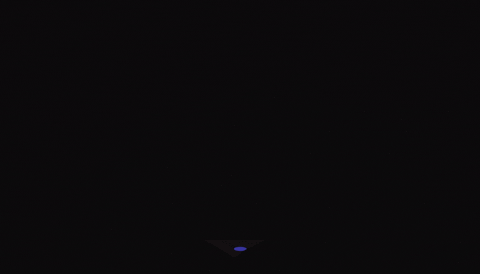

<!-- =======================================================
  🚀 ULTRA-PREMIUM GITHUB PROFILE README
  Name: Reddy Kiranmayi (@rkiranmayisai)
  100% GitHub Native Compatible (Zero Raw HTML Bugs)
======================================================= -->

<div align="center">
  <!-- 🌌 Animated Luxury Multi-Color Waving Header Banner -->
  

  <br /><br />

  <!-- 🎓 Bulletproof HTML Styled Subtitle Box -->
  <div align="center" style="background: #161b22; border: 1.5px solid #ff1744; border-radius: 25px; padding: 10px 24px; display: inline-block;">
    <span style="color: #ff1744; font-weight: 700; font-family: monospace; font-size: 0.95rem;">🎓 B.Tech CSE Student @ ACE &nbsp;•&nbsp; 🏆 GFG Rank #2 &nbsp;•&nbsp; 💻 Full Stack & Data Science &nbsp;•&nbsp; 🚀 500+ DSA</span>
  </div>

  <br /><br />

  <!-- 🔗 Social & Profile Badges -->
  <p align="center">
    <a href="https://rkiranmayisai.github.io/portfolio/" target="_blank">
      
    </a>
    <a href="https://github.com/rkiranmayisai" target="_blank">
      
    </a>
    <a href="https://leetcode.com/u/rkiranmayisai/" target="_blank">
      
    </a>
    <a href="https://www.codechef.com/users/rkiranmayisai" target="_blank">
      
    </a>
    <a href="https://www.geeksforgeeks.org/profile/rkiranmayi36t?tab=activity" target="_blank">
      
    </a>
  </p>

  <br />

  <!-- Multi-Color Gradient Divider -->
  
</div>

<br />

<!-- 💬 FEATURED QUOTE -->
<blockquote align="center">
  <h3 style="color: #ff1744;"><i>“There's nothing more permanent than a temporary hack.”</i></h3>
  <p style="color: #00e5ff;"><b>— Kyle Simpson</b></p>
</blockquote>

<br />

<!-- ⚡ INTERACTIVE TERMINAL HEADER -->
<div align="center">
  
</div>

<br />

```bash
$ npx rkiranmayisai --fetch-profile

✔ Downloading developer profile... [====================] 100%

┌────────────────────────────────────────────────────────────────────────┐
│ Name       : Reddy Kiranmayi                                           │
│ Education  : B.Tech CSE @ ACE Engineering College                      │
│ Core Stack : Java | Python | React | Node.js | MySQL                    │
│ Ranks      : GFG College Rank #2 🏆 | CodeChef 2-Star ⭐                 │
│ DSA Solved : 500+ Problems (LeetCode 1238 + GFG 300+)                  │
│ Status     : Open for Internships & Software Engineering Roles 🚀       │
└────────────────────────────────────────────────────────────────────────┘
```

<br />

<!-- 👩‍💻 IDENTITY MATRIX HEADER -->
<div align="center">
  
</div>

<br />

<table border="0" width="100%">
  <tr>
    <td width="55%" valign="top">

```javascript
const kiranmayi = {
    name: "Reddy Kiranmayi",
    pronouns: "She/Her",
    education: "B.Tech CSE @ ACE Engineering College 🎓",
    specialization: "Full Stack & Data Science 💻",
    achievements: [
        "GFG College Rank #2 🏆",
        "CodeChef 2-Star ⭐",
        "500+ DSA Solved ⚡"
    ],
    motto: "Driven to build impactful tech with coding excellence ^_^"
};
```

    </td>
    <td width="45%" align="center" valign="middle">
      <!-- 🎬 MOVING ANIMATED FEMALE DEVELOPER GIF -->
      
    </td>
  </tr>
</table>

<br />

<!-- 🔄 DAILY ENGINEERING WORKFLOW PIPELINE HEADER -->
<div align="center">
  
</div>

<br />

<table border="0" width="100%">
  <tr>
    <td style="background-color: #161b22; border-left: 6px solid #ffa116; padding: 15px;">
      <h3 style="color: #ffa116;">🌅 MORNING: DSA Grind (09:00 AM)</h3>
      <p>Solving complex Data Structures & Algorithms on LeetCode & GeeksforGeeks.</p>
      <p>
        
        
      </p>
    </td>
  </tr>
  <tr>
    <td style="background-color: #161b22; border-left: 6px solid #ff1744; padding: 15px;">
      <h3 style="color: #ff1744;">💻 AFTERNOON: Full Stack Development (02:00 PM)</h3>
      <p>Architecting interactive React frontends and robust Node.js / Express APIs.</p>
      <p>
        
        
      </p>
    </td>
  </tr>
  <tr>
    <td style="background-color: #161b22; border-left: 6px solid #00e5ff; padding: 15px;">
      <h3 style="color: #00e5ff;">🌙 EVENING: Data Science & Analytics (07:00 PM)</h3>
      <p>Preprocessing datasets with Pandas & generating spatial crime heatmaps with Seaborn.</p>
      <p>
        
        
      </p>
    </td>
  </tr>
</table>

<br />

<!-- ⚙️ TECH STACK & GRAPHIC SKILL MATRIX HEADER -->
<div align="center">
  
</div>

<br />

<table border="0" width="100%">
  <tr>
    <td width="50%" valign="top" style="padding: 10px;">
      <h3 style="color: #ff1744;">🔥 Visual Skill Meters</h3>
      <br />
      <b>☕ Java & Data Structures (90%)</b><br />
      
      <br /><br />
      <b>🌐 HTML5 & CSS3 (85%)</b><br />
      
      <br /><br />
      <b>🐍 Python & Data Science (80%)</b><br />
      
      <br /><br />
      <b>⚛️ React & Frontend (80%)</b><br />
      
      <br /><br />
      <b>🟢 Node.js & Express (70%)</b><br />
      
    </td>
    <td width="50%" valign="top" style="padding: 10px;">
      <h3 style="color: #00e5ff;">🛠️ Tech Arsenal</h3>
      <br />
      <p>
        
        
      </p>
      <br />
      <p>
        
        
      </p>
      <br />
      <p>
        
        
      </p>
      <br />
      <p>
        
        
      </p>
    </td>
  </tr>
</table>

<br />

<!-- 🏆 BADGES & COMPETITIVE RANKS HEADER -->
<div align="center">
  
</div>

<br />

<div align="center">
  <p align="center">
    
    
  </p>
  <p align="center">
    
    
  </p>
</div>

<br />

<!-- 🚀 ARCHITECTURAL PROJECT SHOWCASE HEADER -->
<div align="center">
  
</div>

<br />

<table border="0" width="100%">
  <tr>
    <td style="background-color: #161b22; border-left: 5px solid #ff1744; padding: 18px;">
      <h3 style="color: #ff1744;">🚨 Project 1: Crime Hotspot Detection using Crowdsourced Data</h3>
      <p>Data analysis system using Pandas, Seaborn & Matplotlib for dataset preprocessing, trend analysis, and crime heatmap generation.</p>
      <p>
        <a href="https://github.com/rkiranmayisai/detection-of-crime-hotspot-website" target="_blank">
          
        </a>
      </p>
    </td>
  </tr>
  <tr>
    <td style="background-color: #161b22; border-left: 5px solid #00e5ff; padding: 18px;">
      <h3 style="color: #00e5ff;">🌐 Project 2: Personal Portfolio Website</h3>
      <p>Responsive personal portfolio site with interactive credentials timeline, DSA stats, and project showcase.</p>
      <p>
        <a href="https://github.com/rkiranmayisai/portfolio" target="_blank">
          
        </a>
      </p>
    </td>
  </tr>
</table>

<br /><br />

<!-- LUXURY MULTI-COLOR WAVE FOOTER -->
<div align="center">
  
  <p><b>Created by Reddy Kiranmayi | Always Learning & Building 🚀</b></p>
</div>
