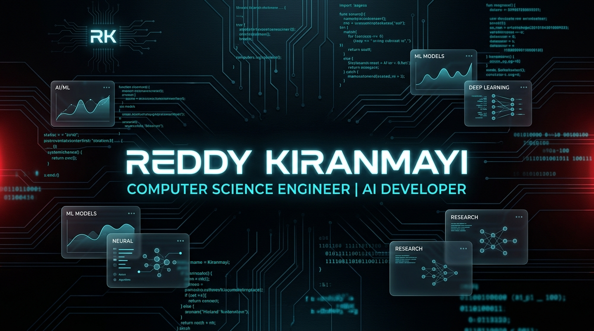

<div align="center">

  <!-- Main Banner Header (Cinematic Dark Red/Cyan Theme) -->
  

  <br/>

  <!-- Title Subtitle -->
  <h1 align="center">
    <font color="#00f2fe">🚀 Computer Science Engineer</font>
  </h1>

  <p align="center">
    <font color="#8b949e"><i>"Transforming raw logic into high-impact intelligent AI & Web solutions."</i></font>
  </p>

  <br/>

  <!-- Dynamic Animated Shell Terminal Subtitle -->
  <a href="https://rkiranmayisai.github.io/portfolio/" target="_blank">
    
  </a>

  <br/><br/>

  <!-- Premium CTA Badges Row -->
  <p>
    <a href="https://rkiranmayisai.github.io/portfolio/" target="_blank">
      
    </a>
    &nbsp;
    <a href="https://github.com/rkiranmayisai" target="_blank">
      
    </a>
    &nbsp;
    <a href="https://leetcode.com/u/rkiranmayisai/" target="_blank">
      
    </a>
    &nbsp;
    <a href="https://www.codechef.com/users/rkiranmayisai" target="_blank">
      
    </a>
    &nbsp;
    <a href="mailto:r.kiranmayisai@gmail.com">
      
    </a>
  </p>

</div>

<br/>

<!-- Red Glowing Line Divider -->


<br/><br/>

<!-- ABOUT ME SECTION WITH CODE BLOCK & HERO ARTWORK -->
<div align="center">
  <h2>✨ About Me</h2>
</div>

```javascript
const kiranmayi = {
    pronouns: "She/Her",
    location: "Hyderabad, Telangana, India 🇮🇳",
    education: "B.Tech CSE @ ACE Engineering College",
    cgpa: "8.99 / 10",
    currentFocus: "AI Medical Diagnostics & Web Apps 🚀",
    learning: ["Advanced Deep Learning", "System Design", "Cloud AI"],
    interests: ["Problem Solving", "Web Development", "AI/ML", "Competitive Coding"],
    motto: "Transforming raw logic into intelligent solutions ✨",

    lifeLoop: function() {
        while (alive) {
            eat();
            code();
            solve();
            repeat();
        }
    }
};
```

<br/>

<!-- Premium Full-Width Developer Artwork Banner -->
<div align="center">
  
</div>

<br/>

<!-- Red Glowing Line Divider -->


<br/><br/>

<!-- ENGINEERING GOALS & FOCUS GRID -->
<div align="center">
  <h2>🎯 2026 Engineering Focus & Objectives</h2>
</div>

<table width="100%" border="0" cellspacing="0" cellpadding="0">
  <tr>
    <td width="50%" valign="top" style="padding: 8px;">
      <div style="padding: 18px; border: 1px solid #30363d; border-radius: 10px; background-color: #161b22; box-shadow: 0 6px 18px rgba(0,0,0,0.3);">
        <h3 style="margin-top:0; color:#00f2fe;">🧠 Deep Learning & AI Diagnostics</h3>
        <p style="color:#c9d1d9; line-height:1.6;">⚡ Developing high-accuracy computer vision web platforms for MRI brain scan classification, plant leaf disease detection, and medical imaging diagnostics.</p>
        <span style="color:#f43f5e; font-weight:bold;">PyTorch &bull; TensorFlow &bull; OpenCV</span>
      </div>
    </td>
    <td width="50%" valign="top" style="padding: 8px;">
      <div style="padding: 18px; border: 1px solid #30363d; border-radius: 10px; background-color: #161b22; box-shadow: 0 6px 18px rgba(0,0,0,0.3);">
        <h3 style="margin-top:0; color:#00f2fe;">🏆 Competitive Coding Milestones</h3>
        <p style="color:#c9d1d9; line-height:1.6;">⚡ Active daily solver on <b>LeetCode (200+)</b>, <b>CodeChef (2★)</b>, and <b>GeeksforGeeks (#2 College Rank)</b> targeting 1500+ ratings.</p>
        <span style="color:#f43f5e; font-weight:bold;">Graph Algorithms &bull; Dynamic Programming</span>
      </div>
    </td>
  </tr>
  <tr>
    <td width="50%" valign="top" style="padding: 8px;">
      <div style="padding: 18px; border: 1px solid #30363d; border-radius: 10px; background-color: #161b22; box-shadow: 0 6px 18px rgba(0,0,0,0.3);">
        <h3 style="margin-top:0; color:#00f2fe;">📊 Data Science & Spatial Analytics</h3>
        <p style="color:#c9d1d9; line-height:1.6;">⚡ Building spatial crime hotspot visualizers, customer segmentation ML models, and interactive enterprise Power BI dashboards.</p>
        <span style="color:#f43f5e; font-weight:bold;">Pandas &bull; Seaborn &bull; Power BI</span>
      </div>
    </td>
    <td width="50%" valign="top" style="padding: 8px;">
      <div style="padding: 18px; border: 1px solid #30363d; border-radius: 10px; background-color: #161b22; box-shadow: 0 6px 18px rgba(0,0,0,0.3);">
        <h3 style="margin-top:0; color:#00f2fe;">🌐 Full-Stack Web Innovation</h3>
        <p style="color:#c9d1d9; line-height:1.6;">⚡ Crafting modern responsive web apps, RESTful integrations, dynamic UI design systems, and cloud utility platforms.</p>
        <span style="color:#f43f5e; font-weight:bold;">React &bull; JavaScript &bull; Node.js</span>
      </div>
    </td>
  </tr>
</table>

<br/>

<!-- Red Glowing Line Divider -->


<br/><br/>

<!-- TECH ARSENAL MATRIX -->
<div align="center">
  <h2>🛠️ Tech Arsenal & Expertise</h2>
</div>

<table border="0" width="100%" cellspacing="0" cellpadding="0">
  <tr>
    <td width="50%" valign="top" style="padding: 10px;">
      <div style="padding: 18px; border: 1px solid #30363d; border-radius: 10px; background-color: #0d1117;">
        <h3 style="color:#00f2fe; margin-top:0;">🎨 Frontend Development</h3>
        <p>
          
          
          
          
        </p>
        <br/>
        <h3 style="color:#00f2fe;">⚙️ Artificial Intelligence & Backend</h3>
        <p>
          
          
          
          
        </p>
      </div>
    </td>
    <td width="50%" valign="top" style="padding: 10px;">
      <div style="padding: 18px; border: 1px solid #30363d; border-radius: 10px; background-color: #0d1117;">
        <h3 style="color:#00f2fe; margin-top:0;">💾 Data Science & Analytics</h3>
        <p>
          
          
          
          
        </p>
        <br/>
        <h3 style="color:#00f2fe;">💻 Languages & Developer Tools</h3>
        <p>
          
          
          
          
          
        </p>
      </div>
    </td>
  </tr>
</table>

<br/>

<!-- Red Glowing Line Divider -->


<br/><br/>

<!-- GITHUB STATS & METRICS DASHBOARD -->
<div align="center">
  <h2>📊 Engineering Metrics & Achievements</h2>

  <br/>

  <table width="100%" border="0" cellspacing="0" cellpadding="0">
    <tr>
      <td width="50%" valign="top" style="padding: 8px;">
        <div style="padding: 18px; border: 1px solid #30363d; border-radius: 10px; background-color: #161b22; text-align: left;">
          <h3 style="margin-top:0; color:#00f2fe;">⚡ GitHub Activity Summary</h3>
          <p style="margin: 8px 0; font-size:15px;">📦 <b>Public Codebases:</b> <font color="#f43f5e"><b>27 Repositories</b></font></p>
          <p style="margin: 8px 0; font-size:15px;">🔥 <b>Daily Coding Habit:</b> <font color="#00f2fe"><b>Active Daily Contributor</b></font></p>
          <p style="margin: 8px 0; font-size:15px;">🌟 <b>Primary Language:</b> <font color="#00f2fe"><b>Python & JavaScript</b></font></p>
          <p style="margin: 8px 0; font-size:15px;">🎓 <b>Academic Score:</b> <font color="#f43f5e"><b>8.99 CGPA / 10</b></font></p>
        </div>
      </td>
      <td width="50%" valign="top" style="padding: 8px;">
        <div style="padding: 18px; border: 1px solid #30363d; border-radius: 10px; background-color: #161b22; text-align: left;">
          <h3 style="margin-top:0; color:#00f2fe;">🏆 Codebase Distribution</h3>
          <p style="margin: 8px 0; font-size:15px;">🐍 <b>Python (AI/ML & Data):</b> <font color="#00f2fe"><b>45%</b></font></p>
          <p style="margin: 8px 0; font-size:15px;">⚡ <b>JavaScript (Web Platforms):</b> <font color="#00f2fe"><b>30%</b></font></p>
          <p style="margin: 8px 0; font-size:15px;">☕ <b>Java / C++ (Algorithms):</b> <font color="#00f2fe"><b>15%</b></font></p>
          <p style="margin: 8px 0; font-size:15px;">🎨 <b>HTML5 & CSS3 (UI Design):</b> <font color="#00f2fe"><b>10%</b></font></p>
        </div>
      </td>
    </tr>
  </table>

  <br/>

  <!-- Bulletproof Shields Matrix -->
  <p>
    
    &nbsp;
    
    &nbsp;
    
    &nbsp;
    
  </p>

</div>

<br/>

<!-- Red Glowing Line Divider -->


<br/><br/>

<!-- COMPETITIVE CODING SECTION -->
<div align="center">
  <h2>⚡ Competitive Coding Achievements</h2>
</div>

<table align="center" width="100%" border="0" cellspacing="0" cellpadding="0">
  <tr align="center">
    <td width="33%" style="padding: 10px;">
      <div style="padding: 16px; border: 1px solid #FFA116; border-radius: 10px; background-color: #161b22;">
        <a href="https://leetcode.com/u/rkiranmayisai/" target="_blank">
          
        </a>
        <h4 style="margin: 10px 0 0 0; color:#c9d1d9;">Solved 200+ Problems</h4>
      </div>
    </td>
    <td width="33%" style="padding: 10px;">
      <div style="padding: 16px; border: 1px solid #5B4638; border-radius: 10px; background-color: #161b22;">
        <a href="https://www.codechef.com/users/rkiranmayisai" target="_blank">
          
        </a>
        <h4 style="margin: 10px 0 0 0; color:#c9d1d9;">2-Star Competitive Coder</h4>
      </div>
    </td>
    <td width="33%" style="padding: 10px;">
      <div style="padding: 16px; border: 1px solid #298D46; border-radius: 10px; background-color: #161b22;">
        <a href="https://www.geeksforgeeks.org/profile/rkiranmayi36t?tab=activity" target="_blank">
          
        </a>
        <h4 style="margin: 10px 0 0 0; color:#c9d1d9;">Solved 300+ Problems</h4>
      </div>
    </td>
  </tr>
</table>

<br/>

<!-- Red Glowing Line Divider -->


<br/><br/>

<!-- FEATURED PROJECTS SHOWCASE -->
<h2>📌 Featured Projects & Codebases</h2>

<table width="100%" border="0" cellspacing="0" cellpadding="0">
  <tr>
    <td width="50%" valign="top" style="padding: 8px;">
      <div style="padding: 16px; border: 1px solid #30363d; border-radius: 10px; background-color: #161b22;">
        <h3 style="margin-top:0;">🧬 <a href="https://rkiranmayisai.github.io/Brain-Tumor-Classifications/" target="_blank" style="color:#00f2fe; text-decoration:none;">Brain Tumor Classifications</a></h3>
        <p style="color:#c9d1d9; line-height:1.5;">A web-based classification platform utilizing deep learning models to identify and classify brain tumor types from MRI scans with high precision.</p>
        <p>🔴 <b>HTML/CSS/JS</b> &bull; 🧠 <b>Deep Learning</b> &bull; <a href="https://github.com/rkiranmayisai/Brain-Tumor-Classifications" target="_blank" style="color:#f43f5e;">Code Repository 🔗</a></p>
      </div>
    </td>
    <td width="50%" valign="top" style="padding: 8px;">
      <div style="padding: 16px; border: 1px solid #30363d; border-radius: 10px; background-color: #161b22;">
        <h3 style="margin-top:0;">🌿 <a href="https://rkiranmayisai.github.io/Plant-Disease-classification/" target="_blank" style="color:#00f2fe; text-decoration:none;">Plant Disease Classification</a></h3>
        <p style="color:#c9d1d9; line-height:1.5;">An AI-powered web platform that analyzes plant leaves to diagnose agricultural diseases and recommend targeted treatments.</p>
        <p>🟡 <b>Python</b> &bull; 🤖 <b>Computer Vision</b> &bull; <a href="https://github.com/rkiranmayisai/Plant-Disease-classification" target="_blank" style="color:#f43f5e;">Code Repository 🔗</a></p>
      </div>
    </td>
  </tr>
  <tr>
    <td width="50%" valign="top" style="padding: 8px;">
      <div style="padding: 16px; border: 1px solid #30363d; border-radius: 10px; background-color: #161b22;">
        <h3 style="margin-top:0;">🚔 <a href="https://github.com/rkiranmayisai/detection-of-crime-hotspot-website" target="_blank" style="color:#00f2fe; text-decoration:none;">Crime Hotspot Detection</a></h3>
        <p style="color:#c9d1d9; line-height:1.5;">Spatial analytics system identifying crime-prone locations using crowdsourced datasets with Pandas, Seaborn heatmaps & geographic maps.</p>
        <p>🔵 <b>Python</b> &bull; 📊 <b>Spatial Data Science</b> &bull; <a href="https://github.com/rkiranmayisai/detection-of-crime-hotspot-website" target="_blank" style="color:#f43f5e;">Code Repository 🔗</a></p>
      </div>
    </td>
    <td width="50%" valign="top" style="padding: 8px;">
      <div style="padding: 16px; border: 1px solid #30363d; border-radius: 10px; background-color: #161b22;">
        <h3 style="margin-top:0;">👥 <a href="https://github.com/rkiranmayisai/Customer-Segmentation-" target="_blank" style="color:#00f2fe; text-decoration:none;">Customer Segmentation ML</a></h3>
        <p style="color:#c9d1d9; line-height:1.5;">Machine learning system clustering customer groups based on purchasing patterns & demographics using K-Means unsupervised learning.</p>
        <p>🔵 <b>Python</b> &bull; 🤖 <b>Scikit-Learn ML</b> &bull; <a href="https://github.com/rkiranmayisai/Customer-Segmentation-" target="_blank" style="color:#f43f5e;">Code Repository 🔗</a></p>
      </div>
    </td>
  </tr>
  <tr>
    <td width="50%" valign="top" style="padding: 8px;">
      <div style="padding: 16px; border: 1px solid #30363d; border-radius: 10px; background-color: #161b22;">
        <h3 style="margin-top:0;">📈 <a href="https://github.com/rkiranmayisai/FUTURE_DS_01" target="_blank" style="color:#00f2fe; text-decoration:none;">Global Sales Performance Dashboard</a></h3>
        <p style="color:#c9d1d9; line-height:1.5;">An interactive Power BI dashboard visualizing worldwide sales metrics, regional performance, product breakdown, and temporal trends.</p>
        <p>🟡 <b>Power BI</b> &bull; 📈 <b>Power Query BI</b> &bull; <a href="https://github.com/rkiranmayisai/FUTURE_DS_01" target="_blank" style="color:#f43f5e;">Code Repository 🔗</a></p>
      </div>
    </td>
    <td width="50%" valign="top" style="padding: 8px;">
      <div style="padding: 16px; border: 1px solid #30363d; border-radius: 10px; background-color: #161b22;">
        <h3 style="margin-top:0;">📁 <a href="https://github.com/rkiranmayisai/portfolio" target="_blank" style="color:#00f2fe; text-decoration:none;">Personal Portfolio Website</a></h3>
        <p style="color:#c9d1d9; line-height:1.5;">Modern, responsive personal portfolio website showcasing projects, skills, and engineering milestones with interactive UI components.</p>
        <p>🟣 <b>JavaScript</b> &bull; 💻 <b>Responsive Design</b> &bull; <a href="https://rkiranmayisai.github.io/portfolio/" target="_blank" style="color:#f43f5e;">Live Site 🔗</a></p>
      </div>
    </td>
  </tr>
</table>

<br/>

<!-- Red Glowing Line Divider -->


<br/><br/>

<!-- ACADEMIC MILESTONES & CERTIFICATIONS SHOWCASE -->
<div align="center">
  <h2>🎓 Academic Distinction & Certifications</h2>
</div>

<table width="100%" border="0" cellspacing="0" cellpadding="0">
  <tr>
    <td width="50%" valign="top" style="padding: 8px;">
      <div style="padding: 18px; border: 1px solid #30363d; border-radius: 10px; background-color: #161b22;">
        <h3 style="margin-top:0; color:#00f2fe;">🎓 Academic Excellence & Degree</h3>
        <p style="margin: 8px 0; color:#c9d1d9;"><b>Degree:</b> B.Tech in Computer Science & Engineering</p>
        <p style="margin: 8px 0; color:#c9d1d9;"><b>Institution:</b> ACE Engineering College, Hyderabad</p>
        <p style="margin: 8px 0; color:#c9d1d9;"><b>CGPA Score:</b> <font color="#f43f5e"><b>8.99 / 10</b></font></p>
        <p style="margin: 8px 0; color:#c9d1d9;"><b>College Rank:</b> <font color="#00f2fe"><b>#2 Rank on GeeksforGeeks</b></font></p>
      </div>
    </td>
    <td width="50%" valign="top" style="padding: 8px;">
      <div style="padding: 18px; border: 1px solid #30363d; border-radius: 10px; background-color: #161b22;">
        <h3 style="margin-top:0; color:#00f2fe;">📜 Specializations & Certifications</h3>
        <p style="margin: 8px 0; color:#c9d1d9;">🤖 <b>AI & Deep Learning:</b> PyTorch & TensorFlow Neural Nets</p>
        <p style="margin: 8px 0; color:#c9d1d9;">📊 <b>Data Analytics:</b> Spatial Hotspots & Power BI Dashboards</p>
        <p style="margin: 8px 0; color:#c9d1d9;">🌐 <b>Web Innovation:</b> React, Modern UI/UX, RESTful APIs</p>
        <p style="margin: 8px 0; color:#c9d1d9;">🧠 <b>Problem Solving:</b> 200+ LeetCode Solved & 2★ CodeChef</p>
      </div>
    </td>
  </tr>
</table>

<br/>

<!-- Red Glowing Line Divider -->


<br/><br/>

<!-- ASK ME ABOUT & TECH QUICK TAGS -->
<div align="center">
  <h2>💬 Technical Discussion & Collaboration</h2>
</div>

<table width="100%" border="0" cellspacing="0" cellpadding="0">
  <tr>
    <td width="50%" valign="top" style="padding: 8px;">
      <div style="padding: 16px; border: 1px solid #30363d; border-radius: 10px; background-color: #0d1117;">
        <h4 style="margin-top:0; color:#f43f5e;">🧠 AI Medical Imaging & Deep Learning</h4>
        <p style="color:#8b949e; margin:0;">Ask me about CNN architectures, MRI brain tumor classification, and PyTorch computer vision pipelines.</p>
      </div>
    </td>
    <td width="50%" valign="top" style="padding: 8px;">
      <div style="padding: 16px; border: 1px solid #30363d; border-radius: 10px; background-color: #0d1117;">
        <h4 style="margin-top:0; color:#00f2fe;">⚡ Data Structures & Graph Algorithms</h4>
        <p style="color:#8b949e; margin:0;">Ask me about LeetCode problem solving, dynamic programming patterns, and time complexity optimization.</p>
      </div>
    </td>
  </tr>
  <tr>
    <td width="50%" valign="top" style="padding: 8px;">
      <div style="padding: 16px; border: 1px solid #30363d; border-radius: 10px; background-color: #0d1117;">
        <h4 style="margin-top:0; color:#00f2fe;">📊 Spatial Analytics & Power BI</h4>
        <p style="color:#8b949e; margin:0;">Ask me about crime hotspot detection algorithms, Pandas data wrangling, and interactive dashboard design.</p>
      </div>
    </td>
    <td width="50%" valign="top" style="padding: 8px;">
      <div style="padding: 16px; border: 1px solid #30363d; border-radius: 10px; background-color: #0d1117;">
        <h4 style="margin-top:0; color:#f43f5e;">🌐 Responsive Full-Stack Web Apps</h4>
        <p style="color:#8b949e; margin:0;">Ask me about modern JavaScript (ES6+), React component architecture, and high-performance UI systems.</p>
      </div>
    </td>
  </tr>
</table>

<br/><br/>

<!-- FOOTER PROFILE VIEWS -->
<div align="center">
  
</div>
