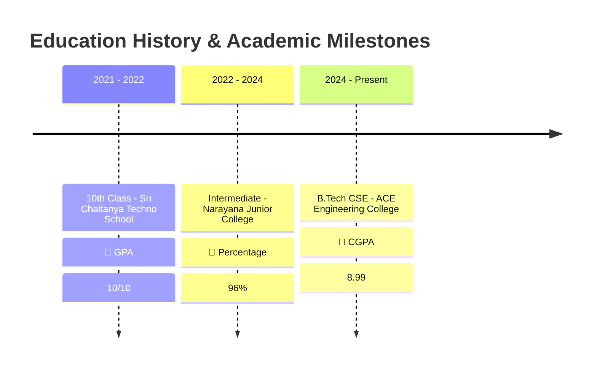

<div align="center">

  <!-- Header Banner / Image -->
  

  <br/>

  <!-- Dynamic Typing & Badges -->
  <a href="https://rkiranmayisai.github.io/portfolio/">
    
  </a>

  <br/><br/>

  <!-- Quick Badges -->
  <a href="https://rkiranmayisai.github.io/portfolio/">
    
  </a>
  <a href="mailto:r.kiranmayisai@gmail.com">
    
  </a>
  <a href="https://leetcode.com/u/rkiranmayisai/">
    
  </a>
  <a href="https://www.codechef.com/users/rkiranmayisai">
    
  </a>
  <a href="https://www.geeksforgeeks.org/profile/rkiranmayi36t?tab=activity">
    
  </a>

</div>

<hr/>

## 💫 About Me

<table border="0">
  <tr>
    <td width="65%" valign="top">
      <p>Hi there! 👋 I'm <b>Reddy Kiranmayi</b>, a dedicated <b>Computer Science & Engineering student</b> at <b>ACE Engineering College</b> (CGPA: <b>8.99</b>) with a strong foundation in <b>Data Structures & Algorithms</b>, <b>Machine Learning</b>, and <b>Full-Stack Web Development</b>.</p>
      <p>🚀 Driven by curiosity and innovation, I specialize in building <b>AI-powered medical & agricultural web applications</b>, analyzing complex datasets using Python & Power BI, and solving competitive coding challenges.</p>
      <ul>
        <li>🎓 <b>Education:</b> B.Tech in CSE @ ACE Engineering College (2024 - Present)</li>
        <li>📍 <b>Location:</b> Hyderabad, Telangana, India</li>
        <li>💡 <b>Interests:</b> Computer Vision, Deep Learning, Algorithmic Problem Solving & Intelligent Web Systems</li>
        <li>🏆 <b>Key Achievements:</b> College Rank <b>#2</b> on GeeksforGeeks, <b>200+</b> LeetCode problems solved, <b>2★ Coder</b> on CodeChef</li>
      </ul>
    </td>
    <td width="35%" align="center" valign="middle">
      
      <br/><br/>
      <a href="https://rkiranmayisai.github.io/portfolio/">
        
      </a>
    </td>
  </tr>
</table>

<hr/>

## 🛠️ Tech Stack & Skills

<div align="center">

### 💻 Programming Languages


### 🤖 Artificial Intelligence & Data Science


### 🌐 Web & Frameworks


### ⚡ Core Foundations & Tools


</div>

<hr/>

## ⚡ Competitive Coding Achievements

```
 🏆 GEEKS FOR GEEKS    :  College Rank #2  |  300+ Problems Solved
 ⚡ LEETCODE           :  Rating 1238      |  200+ Problems Solved
 ⭐ CODECHEF           :  Rating 1418      |  2-Star Coder
```

<div align="center">

| Platform | Rating / Rank | Details | Link |
| :--- | :---: | :---: | :---: |
|  **LeetCode** | **1238** | Solved 200+ DSA Problems | [View Profile](https://leetcode.com/u/rkiranmayisai/) |
|  **CodeChef** | **1418 (2★)** | 2-Star Competitive Coder | [View Profile](https://www.codechef.com/users/rkiranmayisai) |
|  **GeeksforGeeks** | **Rank #2** | Solved 300+ Algorithmic Problems | [View Profile](https://www.geeksforgeeks.org/profile/rkiranmayi36t?tab=activity) |

</div>

<hr/>

## 🌟 Featured Web Applications & AI Projects

### 🧠 Medical & AI Web Tools
<table width="100%">
  <tr>
    <td width="50%" valign="top">
      <h3>🧬 Brain Tumor Classifications</h3>
      <p>A web-based medical diagnosis tool utilizing deep learning neural networks to detect and classify brain tumor types from MRI neuroimaging scans.</p>
      <p><b>Tech Stack:</b> Python, Deep Learning, Computer Vision, HTML/CSS/JS</p>
      <a href="https://rkiranmayisai.github.io/Brain-Tumor-Classifications/">🔗 <b>Live Web Demo</b></a>
    </td>
    <td width="50%" valign="top">
      <h3>🌿 Plant Disease Classification</h3>
      <p>An AI-powered agricultural web application analyzing leaf imagery to diagnose plant pathologies and suggest actionable treatment recommendations.</p>
      <p><b>Tech Stack:</b> Python, Image Recognition, AI, Web UI</p>
      <a href="https://rkiranmayisai.github.io/Plant-Disease-classification/">🔗 <b>Live Web Demo</b></a>
    </td>
  </tr>
  <tr>
    <td width="50%" valign="top">
      <h3>🩺 Skin Cancer Classification Website</h3>
      <p>Medical image classification interface designed for early detection and assessment of skin cancer lesions.</p>
      <p><b>Tech Stack:</b> Machine Learning, Healthcare Tech, Web App</p>
      <a href="https://rkiranmayisai.github.io/Skin-Cancer-Classification-Website/">🔗 <b>Live Web Demo</b></a>
    </td>
    <td width="50%" valign="top">
      <h3>🍎 Fruit & Vegetable Classification</h3>
      <p>Interactive computer vision web tool that accurately identifies and categorizes diverse produce varieties from photos.</p>
      <p><b>Tech Stack:</b> Deep Learning, Image Classification, Web</p>
      <a href="https://rkiranmayisai.github.io/Fruit-Vegetable-Classfication/">🔗 <b>Live Web Demo</b></a>
    </td>
  </tr>
</table>

### 📊 Data Analytics & Machine Learning Projects
<table width="100%">
  <tr>
    <td width="50%" valign="top">
      <h3>🚔 Crime Hotspot Detection</h3>
      <p>Data analytics system identifying high-risk crime zones using crowdsourced spatial datasets. Generates heatmaps and temporal trend analysis.</p>
      <p><b>Tech:</b> Python, Pandas, Matplotlib, Seaborn, Heatmaps</p>
      <a href="https://github.com/rkiranmayisai/detection-of-crime-hotspot-website">🐙 <b>GitHub Repository</b></a>
    </td>
    <td width="50%" valign="top">
      <h3>👥 Customer Segmentation ML</h3>
      <p>Unsupervised Machine Learning model grouping consumers by purchasing behavior and demographics using K-Means Clustering algorithms.</p>
      <p><b>Tech:</b> Python, Scikit-learn, K-Means, Matplotlib</p>
      <a href="https://github.com/rkiranmayisai/Customer-Segmentation-">🐙 <b>GitHub Repository</b></a>
    </td>
  </tr>
  <tr>
    <td width="50%" valign="top">
      <h3>📈 Global Sales Performance Dashboard</h3>
      <p>Interactive Power BI analytics dashboard visualizing worldwide sales metrics, regional distributions, and revenue trendlines.</p>
      <p><b>Tech:</b> Power BI, Power Query, Data Modeling</p>
      <a href="https://github.com/rkiranmayisai/FUTURE_DS_01">🐙 <b>GitHub Repository</b></a>
    </td>
    <td width="50%" valign="top">
      <h3>❤️ Heart Disease Analysis & ML</h3>
      <p>Statistical correlation modeling & machine learning classification algorithms trained on Cleveland Clinic patient datasets.</p>
      <p><b>Tech:</b> Python, Seaborn, Scikit-learn, Jupyter</p>
      <a href="https://github.com/rkiranmayisai/heart-disease-using-seaborn">🐙 <b>GitHub Repository</b></a>
    </td>
  </tr>
</table>

### 💻 Web Applications & Utilities
<table width="100%">
  <tr>
    <td width="33%" valign="top">
      <h4>💰 Finance Tracker</h4>
      <p>Personal finance budget monitor to track income, expenses, and visual spending habits.</p>
      <a href="https://github.com/rkiranmayisai/Finance-tracker">🐙 GitHub Repo</a>
    </td>
    <td width="33%" valign="top">
      <h4>🛍️ E-Commerce Product Page</h4>
      <p>Responsive e-commerce showcase page with dynamic gallery & interactive cart functionality.</p>
      <a href="https://rkiranmayisai.github.io/E-commerce-product-page/">🔗 Live Site</a>
    </td>
    <td width="33%" valign="top">
      <h4>🍳 Recipe Finder</h4>
      <p>Recipe discovery web application querying meals by ingredients, cuisine, and meal type.</p>
      <a href="https://rkiranmayisai.github.io/Recipe-finder/">🔗 Live Site</a>
    </td>
  </tr>
  <tr>
    <td width="33%" valign="top">
      <h4>🌤️ Weather Prediction Website</h4>
      <p>Real-time weather forecast website providing multi-day meteorological insights.</p>
      <a href="https://rkiranmayisai.github.io/Weather-predictio-2/">🔗 Live Site</a>
    </td>
    <td width="33%" valign="top">
      <h4>📝 To-Do List Application</h4>
      <p>Clean task management web application to organize daily objectives & progress.</p>
      <a href="https://rkiranmayisai.github.io/ToDoList/">🔗 Live Site</a>
    </td>
    <td width="33%" valign="top">
      <h4>🔑 Password Generator</h4>
      <p>Customizable cryptographic random password generation tool for enhanced online security.</p>
      <a href="https://rkiranmayisai.github.io/PasswordGenerator/">🔗 Live Site</a>
    </td>
  </tr>
</table>

<hr/>

## 📜 Certifications & Verification

| Certification Title | Issuing Organization | Year | Credential Link |
| :--- | :--- | :---: | :---: |
| 🎓 **DSA Problem Solving for Interviews using Java** | Scaler Topics | 2026 | [Verify Certificate 🔗](https://moonshot.scaler.com/s/sl/rWaoTV4fbm) |
| 💻 **Operating Systems** | NPTEL (SWAYAM) | 2026 | [Verify Certificate 🔗](https://drive.google.com/file/d/1UWCzCBNmt-U9A4hc84gyQxD9WtsySxqY/view?usp=sharing) |
| 🤖 **Multimodal AI & Emerging Innovation** | ACE Engineering College | 2026 | [Verify Certificate 🔗](https://drive.google.com/file/d/1ZlC3BVrDFbNLZty0eyStuKtYHHN0R6kz/view?usp=sharing) |
| ⚡ **Agent Blazer Champion** | Salesforce | 2024 | [Verify Certificate 🔗](https://drive.google.com/file/d/1y4nbbVjawVon5OT7Ss3QwTqp4WTQGGvf/view?usp=drive_link) |
| 🐍 **Python Programming** | Guvi / Python | 2024 | [Verify Certificate 🔗](https://drive.google.com/file/d/1f3flHvMNg13T7aa5dTQzS1foeSYkExEj/view?usp=drive_link) |
| 📊 **Data Analytics Job Simulation** | Deloitte | 2024 | [Verify Certificate 🔗](https://drive.google.com/file/d/1qWJit9b3IdEBkOxk4wo3KFZtiSDJAw1u/view?usp=drive_link) |

<hr/>

## 🎓 Academic Timeline



<hr/>

## 📊 GitHub Analytics & Trophy Hall

<div align="center">

  

  <br/><br/>

  <table border="0">
    <tr>
      <td>
        
      </td>
      <td>
        
      </td>
    </tr>
    <tr>
      <td colspan="2" align="center">
        
      </td>
    </tr>
  </table>

</div>

<hr/>

## 📫 Connect & Contact Me

<div align="center">

  <a href="mailto:r.kiranmayisai@gmail.com">
    
  </a>
  <a href="https://rkiranmayisai.github.io/portfolio/">
    
  </a>
  <a href="https://github.com/rkiranmayisai">
    
  </a>
  <a href="https://leetcode.com/u/rkiranmayisai/">
    
  </a>

  <br/><br/>

  <p>📍 <b>Location:</b> Hyderabad, Telangana, India</p>
  <p>📞 <b>Phone:</b> +91 8985488589</p>

</div>

<hr/>

<div align="center">
  <p>Designed with ❤️ for <b>Reddy Kiranmayi</b></p>
  
</div>
